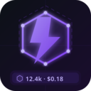

# AI Token Tracker

<p align="center">
  
</p>

<p align="center">
  <strong>A VS Code extension that tracks your Claude Code token usage in real time.</strong><br/>
  Parses local log files — no API interception, no telemetry, no cloud.
</p>

<p align="center">
  
  
  
</p>

---

## What it does

The status bar shows live stats while you work:

```
⬡ 12.4k · $0.18 · sonnet-4-6
```

Click it to open a coloured summary panel right inside VS Code:

- **Today / 7-day / 30-day** token totals with estimated cost
- **Per-session breakdown** — project, model, input/output tokens, cost
- **Rate-limit events** — when Claude Code paused and for how long
- **"Open full dashboard"** button → launches the React web app

An optional local REST API (port 7842) feeds a React dashboard with charts, history, and per-project cost breakdowns.

---

## Features

- Live status bar item with violet accent colour — always visible while coding
- Coloured webview panel — purple/blue/green stat cards, model badges per family
- Per-project tracking tied to the active VS Code workspace
- Detects `claude-opus`, `claude-sonnet`, `claude-haiku` — with distinct badge colours
- Rate-limit detection and wait-time logging
- SQLite storage — all local, zero external requests
- `pricing.json` — edit token rates without touching code

---

## Installation

### Option A — Run from source (development)

```powershell
git clone https://github.com/GHT4ngo/ai-token-tracker.git
cd ai-token-tracker
npm install
npm run bundle        # compiles TypeScript with esbuild
```

Press **F5** in VS Code to launch the Extension Development Host. The tracker activates immediately.

### Option B — Install as a .vsix (permanent)

```powershell
npm install -g @vscode/vsce
vsce package
code --install-extension ai-token-tracker-0.1.0.vsix
```

> **Note:** The `.vsix` bundles everything — no `node_modules` needed on the target machine.

---

## Web Dashboard (optional)

The extension can serve token data over a tiny local REST API, which the included React frontend consumes.

**Step 1 — Enable the API** in VS Code settings (`Ctrl+,`):

```json
"tokenTracker.enableServer": true,
"tokenTracker.apiPort": 7842
```

**Step 2 — Start the frontend:**

```bash
cd frontend
npm install
npm run dev
# → http://localhost:8080
```

**Step 3 —** Click **⬡ Open full dashboard** in the extension panel, or run the command palette entry `AI Token Tracker: Open Web Dashboard`.

> The `dashboardPort` setting (default `8080`) controls which port the button opens.

---

## Settings

| Setting | Type | Default | Description |
|---|---|---|---|
| `tokenTracker.enableServer` | boolean | `false` | Start the local REST API |
| `tokenTracker.apiPort` | number | `7842` | Port for the REST API |
| `tokenTracker.dashboardPort` | number | `8080` | Port the "Open dashboard" button opens |
| `tokenTracker.logDirectory` | string | *(auto)* | Override Claude log path |

---

## Log file detection

The extension auto-detects Claude Code log files:

| Platform | Path watched |
|---|---|
| Windows | `%USERPROFILE%\.claude\projects\` |
| macOS / Linux | `~/.claude/projects/` |

Override with `tokenTracker.logDirectory` if your setup is non-standard.

---

## Cost estimates

Shown costs are **retail API equivalents** — informational only.
They do not reflect your actual Claude subscription bill.

| Model | Input | Output | Cache write | Cache read |
|---|---|---|---|---|
| claude-opus-4-7 | $15/M | $75/M | $18.75/M | $1.50/M |
| claude-sonnet-4-6 | $3/M | $15/M | $3.75/M | $0.30/M |
| claude-haiku-4-5 | $0.80/M | $4/M | $1.00/M | $0.08/M |

Edit `src/pricing.json` to update rates — no recompile needed (it's copied into `out/` at build time).

---

## Data storage

```
%APPDATA%\Code\User\globalStorage\tango-solutions.ai-token-tracker\token_tracker.json
```

Nothing leaves your machine.

---

## Project structure

```
ai-token-tracker/
├── src/
│   ├── extension.ts      ← entry point — activates watchers, status bar, commands
│   ├── logParser.ts      ← tails Claude log files, emits token/rate-limit events
│   ├── db.ts             ← SQLite schema and query helpers
│   ├── pricing.ts        ← cost estimation logic
│   ├── pricing.json      ← editable pricing table (copied to out/ at build)
│   ├── statusBar.ts      ← VS Code status bar item
│   ├── webviewPanel.ts   ← in-editor summary panel (HTML/CSS)
│   └── server.ts         ← optional Express REST API
├── frontend/             ← React + Recharts dashboard (Vite)
├── images/
│   └── icon_small.svg    ← extension icon (convert to icon.png for Marketplace)
├── CLAUDE.md             ← architecture notes for AI-assisted development
├── lovable-prompt.md     ← prompt to regenerate the frontend via Lovable.dev
└── package.json
```

---

## How to continue building

The project is designed to be extended. Key files and what to change:

| Goal | Where to look |
|---|---|
| Add a new stat to the panel | `src/webviewPanel.ts` → `buildHtml()` |
| Track a new event type | `src/logParser.ts` → add a regex/parser |
| New REST endpoint | `src/server.ts` → add an Express route |
| New DB table or query | `src/db.ts` |
| Update token prices | `src/pricing.json` — no recompile needed |
| Rebuild the web dashboard | Paste `lovable-prompt.md` into [Lovable.dev](https://lovable.dev) |

**Architecture overview:**

```
logParser.ts
  └── watches ~/.claude/projects/**/*.jsonl for new lines
  └── emits: { inputTokens, outputTokens, cacheTokens, model, project, timestamp }
        ↓
db.ts  ← persists records to SQLite
        ↓
statusBar.ts     ← queries totals on each event, updates the status bar
webviewPanel.ts  ← queries history on open/refresh, renders HTML
server.ts        ← queries on each API call, returns JSON
```

**Adding a new model:**

1. Open `src/pricing.json`
2. Add an entry matching the model ID prefix (e.g. `"claude-opus-5-0"`)
3. Rebuild: `npm run bundle`

**Publishing to the VS Code Marketplace:**

1. Convert `images/icon.svg` → `images/icon.png` (128×128)
2. Register at [marketplace.visualstudio.com](https://marketplace.visualstudio.com/manage)
3. `vsce publish`

---

## Contributing

PRs and issues welcome. See `CLAUDE.md` for detailed architecture notes — it's written to be pasted into Claude Code for AI-assisted development on this repo.

---

## License

MIT
