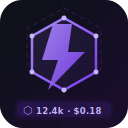

# AI Token Tracker — VS Code Extension



Passively tracks your **Claude Code** token usage by watching local log files. No API interception — just log parsing.

Shows a live counter in the VS Code status bar:

```
⬡ 12.4k · $0.18 · sonnet-4-6
```

Click it to open an in-editor summary panel. Optionally serves a local REST API for the included React dashboard.

---

## Features

- Live status bar: tokens used, estimated cost, active model
- Per-project token tracking (tied to VS Code workspace)
- Rate-limit event detection and logging
- In-editor summary panel (sessions, 7-day / 30-day totals)
- Optional local REST API (port 7842) for the web dashboard
- All data stored locally — nothing sent to any server

---

## Quick Start

### 1. Install & compile

```powershell
npm install
npm run compile
```

### 2. Run in VS Code

Press **F5** with this folder open. The extension host launches with the tracker active.

### 3. Install permanently

```powershell
npm install -g @vscode/vsce
vsce package
code --install-extension ai-token-tracker-0.1.0.vsix
```

---

## Web Dashboard (optional)

Enable the local API in VS Code settings:

```json
"tokenTracker.enableServer": true,
"tokenTracker.apiPort": 7842
```

Then start the frontend:

```bash
cd frontend
npm install
npm run dev
```

Open `http://localhost:8080` — it auto-connects to port 7842.

---

## Settings

| Setting | Default | Description |
|---|---|---|
| `tokenTracker.enableServer` | `false` | Start the REST API for the web dashboard |
| `tokenTracker.apiPort` | `7842` | Port for the local REST API |
| `tokenTracker.logDirectory` | *(auto)* | Override Claude log path (auto-detects `~/.claude/projects/`) |

---

## Log file detection

| Platform | Auto-detected path |
|---|---|
| Windows | `%USERPROFILE%\.claude\projects\` |
| macOS / Linux | `~/.claude/projects/` |

---

## Cost estimates

Costs shown are **retail API equivalents** — informational only, not your actual subscription bill.
Edit `src/pricing.json` to update rates if Anthropic changes pricing.

| Model | Input | Output |
|---|---|---|
| claude-opus-4-7 | $15/M | $75/M |
| claude-sonnet-4-6 | $3/M | $15/M |
| claude-haiku-4-5 | $0.80/M | $4/M |

---

## Data storage

```
%APPDATA%\Code\User\globalStorage\nac.ai-token-tracker\token_tracker.json
```

Nothing is sent to any external server.

---

## Icon

The extension icon lives at `images/icon.svg`. For Marketplace publishing, convert it to a 128×128 PNG and reference `images/icon.png` in `package.json`.

---

## Contributing

PRs welcome. See `CLAUDE.md` for architecture details and `lovable-prompt.md` to regenerate the web dashboard via Lovable.dev.
